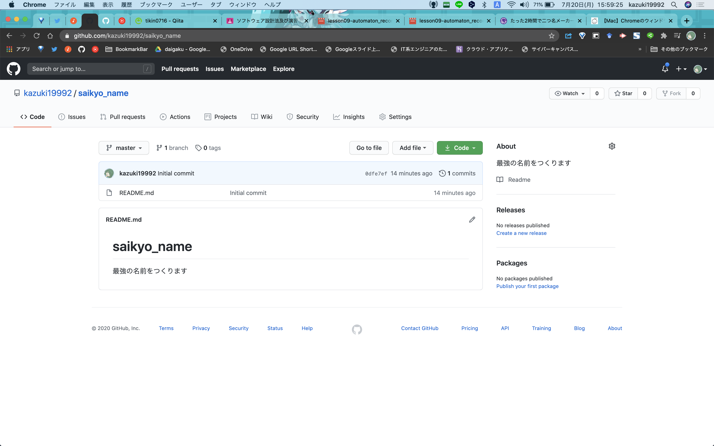

#### こんにちは！！！！！！！！
こんにちは！！！！！！！！！！！！！！！！！！！！！！！！（クソでか挨拶）  
みんな大好き、カズ之助くんです。といっても、このブログから入った人は「誰だよオメーは」となっているに違いありません。  
私はただの一般人でございます。  
今日は**カズ之助**の名前だけ覚えてくれたらもうそれだけでいいです。お疲れさまでした。また会いましょう。

#### 用意するもの
さて、今回はタイトルにもある通り、サクッと作れるお名前メーカーを作っていこうと思います。  
まずは必要なソフトについてです。  
<div class="list">
    <ol>
        <li><a href="https://www.google.com/intl/ja_jp/chrome/" target="_brank">Google Chrome</a></li>
        <li><a href="https://code.visualstudio.com/download" target="_brank">VScode</a>（ほか<a href="https://www.kaoriya.net/software/vim/" target="_brank" style="text-decoration: none; color: #000;">何らかのテキストエディター</a>）</li>
        <li><a href="https://github.com/join?ref_cta=Sign+up&ref_loc=header+logged+out&ref_page=%2F&source=header-home" target="_brank">GitHubアカウント</a></li>
        <li>お使いのOS用のGitとGitの初期設定を済ませる！(<a href="https://eng-entrance.com/git-install" target="_brank">Windows</a>, <a href="http://mtntmyk.hatenablog.com/entry/2018/01/28/115234" target="_brank">macOS</a>, <a href="https://linux.keicode.com/prog/git-install.php" target="_brank">Linux(Ubuntu)</a>)</li>
        <div class="list">
            <ul>
                <li class="ul">メールアドレス, ユーザーネームの登録も忘れないでね！！！</li>
            </ul>
        </div>
        <li><strong>「がんばるぞい」という気持ち</strong></li>
    </ol>
</div>
特にいちばん重要なのは最後の「頑張るぞい」という気持ちです。これがないと何も始まりません。ぜひ持っておきたい気持ちですね。

あらかじめ用意してきてくださいね！！！

#### 準備

##### GitHubリポジトリの作成
さて、それでは早速プログラミング……と、その前にやっておくことがあります。  
まぁ別に後からでもいいんですけど…… 少し面倒なので今のうちにやってしまいましょう。

さて、ここでは**GitHubリポジトリの作成**というものをやっていきます！！！！

ではまず、[GitHub](https://github.com)のページにアクセスしましょう！！  
すると、表示は違えど、だいたいこんな感じの画面になると思います！！

なりましたか？？？なりましたね？？？？？  
じゃあ、次！！  
右上のヘッダーの部分にある`+`ボタンをクリックして、その中の`New repository`をクリックしましょう！！

さすれば、下のような画面になるはずです！！なった？？？？なったね？？？


僕はリポジトリ名を`saikyo_name`、リポジトリの説明を`最強の名前をつくります`にしました。  
PublicかPrivateかはソースコードを皆に公開するか非公開にするかの違いなのでお好きにどうぞ！

下の`Initialize this repository with a README`のチェックボックスはどちらでもいいです。僕はオンにしました。  
最後の2つのメニューは両方とも`None`で！！後からいかようにもできます！  


最終的にはこんな感じになってると思うので、下の`Create repository`をクリックしてください！！

こんな画面になったと思います！！！  

なったね？？？？？？？？次進むよ？？？

そしたら、<span class="green-text">緑色</span>の`code`ボタンをクリック！

URLっぽいやつの隣のバインダーみたいなボタンをクリック！！

このURLみたいなやつがコピーされます！！

##### Gitリポジトリのクローン
では、ここまできたらターミナル（Windowsではコマンドプロンプト）を開いてください！！

こんな感じの黒い画面のやつ（macの標準ターミナルは白背景のやつ）です！！Windowsでは"コマンドプロンプト"って名前だったかな？？  
とりあえずそれを起動したら、今作ったリポジトリをダウンロード（**クローン**と言います）するフォルダー（ディレクトリ）に移動しよう！  
移動方法は下の`ターミナルでのフォルダー（カレントディレクトリ）移動方法`に簡単に書いてあるのでそれを見るか、ご自分で調べてください！！

で、移動できたらターミナルに以下の内容を入力しよう！（先頭の`$`は入力しないでね！）  
```shell
$ git clone さきほどコピーしたURL
```
入力したら`Enter`(macOSでは`return`キー)を押そう！
こんな感じになっていればオッケー！


さて、ここまでやったところで、気づいたらもう3000文字です。絶対推敲が必要なんですけど面倒くさいのでこのまま出しちゃいます。  

文字数も多くなってきたところで、今回はここまで！  
「全然プログラム書いてないじゃん！！！！」とか「何もしてないよ！！！」という声があちこちから聞こえてきそうですがごめんなさい僕は疲れたしお腹空いてきました。  
今回は何もできてないですが、でもこれで準備万端です。次回から早速ゴリゴリ書いていきましょう！！！お疲れさまでした！！

###### ターミナルでのフォルダー（カレントディレクトリ）移動方法
`cd`コマンドというものを使います。`cd`とは、カレントディレクトリ（CurrentDirectory）の略だったような気がします（自分で調べてみてね！）

**cdコマンドのつかいかた**
1. 一個上の階層に移動したいとき
   - `cd ../`
2. 現在の階層のフォルダーに入りたいとき
   - `cd ./フォルダー名/`

Windowsではエクスプローラー（タスクバーにある黄色のフォルダーのアイコンクリックすると出てくるやつ）で目的のフォルダーまで移動してから、`Shift+右クリック`で出てくるメニュー内の`コマンドプロンプト（Windows Terminal, PowerShellの場合もあり）で開く`をクリックすると楽に開けるよ！

