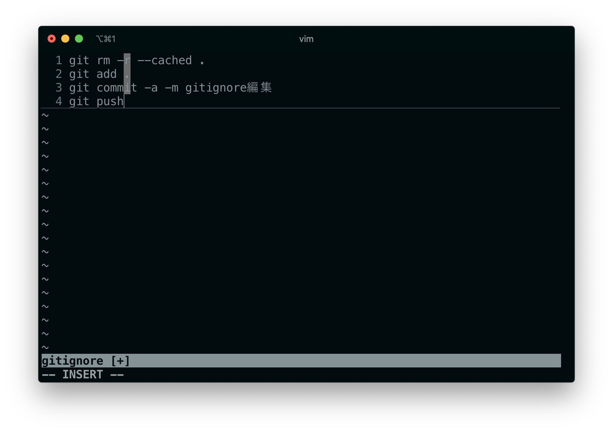
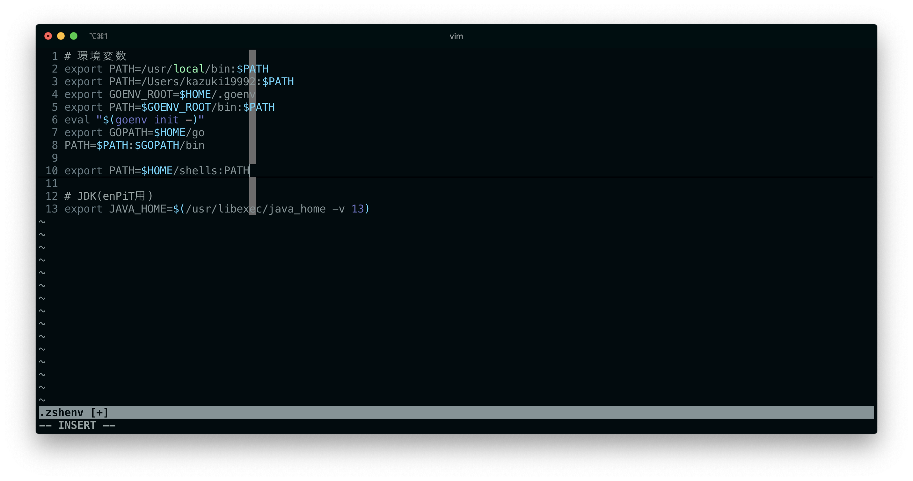
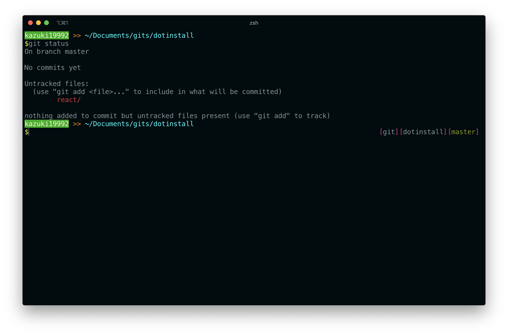
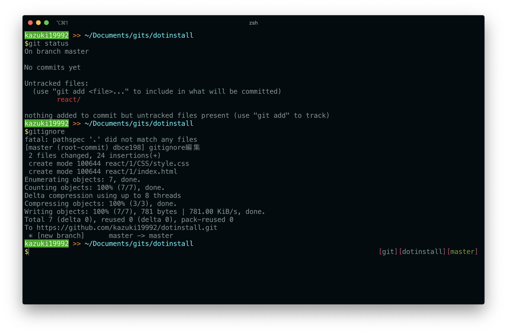
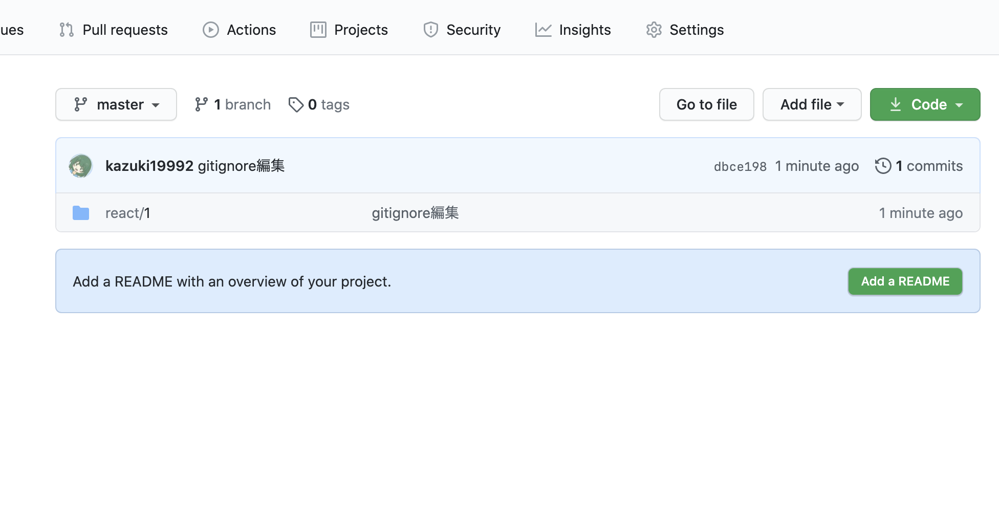
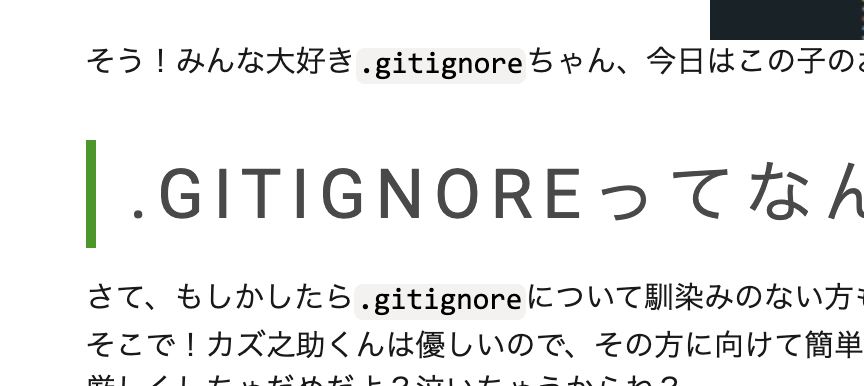

#### お久しぶりです！！！！！！！！！！！
こんにちは！！！！！！！！！！！！！！！！！！！！！！！！（クソでか挨拶）  
みんな大好き、カズ之助くんです。  
みなさん！突然ですが、こいつ、見覚えあるでしょう？？？

そう！みんな大好き`.gitignore`ちゃん、今日はこの子のお話です！

#### .gitignoreってなんだぁ！？
さて、もしかしたら`.gitignore`について馴染みのない方もいるかもしれません！  
そこで！カズ之助くんは優しいので、その方に向けて簡単に説明します！間違えてたら[カズ之助くん](https://Twitter.com/Tech_Kazu)に優しく教えてくだしあ……  
厳しくしちゃだめだよ？泣いちゃうからね？

この`.gitignore`さん、ざっくり説明すると、**Gitで追跡しないファイルをずらずらーっと書き連ねたもの**です！  
実際にどんな感じで書かれているか見てみましょう！！
```.gitignore
# 追跡しない拡張子
*.css
*.html
*.js

# 追跡しないファイル
workspace.json
```
こんな感じに`$git add`時や`$git commit`時に無視するファイル拡張子や無視するファイルを書き連ねていくファイルになります！  
Gitさん(超優秀)が、ステージング(`$git add`の作業)とかの作業をするときに`.gitignore`を見て「このファイルはaddしなくてヨシ！(現場猫並感)」としてくれるんです！有能ちゃんですね！

#### .gitignoreを読んでくれない！
さて、そんな超有能なgitちゃんですが、`.gitignore`を読んでくれないときがあります……  
一体どんなときかというと、(僕の環境では)`.gitignore`を作った直後や、編集した直後などに読んでくれないことが多いです……  
Gitﾁｬﾝ、どうして僕🙋‍♂️の愛💓💗の手紙(ルビ:ラブレター)💌💖💕を読んで👀くれない😢のカナ❓😅

さて、みなさんならこんなときどうしますか？？？  
- 普通にgitのキャッシュを削除してからコミットする？
- それとも、`.git`ディレクトリを消し飛ばして`$git init`する？ ←これすき
- それとも毎回`gitignore 反映`とかでGoogle検索してる？ ←これぼく

#### 面倒くさくなってきちゃった
とりあえず僕は**コマンドなぞまったく覚えるつもりが無かった**ため、毎回google検索していたんですが、いい加減面倒くさくなってきたんですよね  
「じゃあコマンド覚えろや」ってね。わかる。なんで覚えないんだろうね。アホなのかな？

とにかく面倒くさくなって仕方なくなってしまったので、調べなくて済むように`.gitignore`を更新したら実行する簡単なシェルスクリプトを組むことにしました。  
シェルスクリプト、みなさんわかりますか？僕は大学入ってから「そんなのもあるのか〜」って学びました。

まぁ一回作っちまえば後は更新するたびにそのシェルスクリプトを叩けばいいので、カズ之助くんはコマンドをいちいち調べなくていいし、コマンドを覚えなくて済むので一石二鳥なんですよね。  
まぁ社会人になってgitのキャッシュ削除のコマンドを覚えていないのは流石にどうなのかというのもあるので覚えますけど。いずれ、ねぇ。覚えますとも。

#### シェルスクリプトを作っていこう
さて、カズ之助くんがシェルスクリプトに求める条件を書いていこう
1. gitのキャッシュを消してくれること
2. `$git add`してくれること
3. `$git commit`してくれること
4. `$git push`してくれること
5. どのディレクトリからでも呼び出せること

うん。簡単だね。そうだね。

まぁ簡単なのでさっさと書いていきましょう  
```shell
git rm -r --cached .
git add .
git commit -a -m gitignore編集
git push
```
はい。コマンドを列挙しただけですね。

簡単すぎますね。サルでも書くだけならできそう。

これを適当な名前(たとえば`gitignore`とか)で保存します。(これが呼び出し時の名前になります)  
で、それをパスの通っているディレクトリ直下においておきましょう。

おけた？いいわね。
そしたらパーミッションを適当に変更していきますわよ。
セキュリティガバガバ兄貴はこう変更してくださいね。
```shell
$ chmod 777 ./保存した名前
```

##### パスの通し方(Linux, Mac向け:zsh解説)
さて、「パスが通ってないよぴえんぴえん🥺🥺🥺🥺🥺」という方にパスの通し方を説明します。  
まず、ホームディレクトリにある`.zshenv`というファイルを[任意のテキストエディタ](https://azure.microsoft.com/ja-jp/products/visual-studio-code/)で開きます。なければ作っちゃっておkです。  
で、`.zshenv`内に以下の行を追記しましょう。
```shell
export PATH=ここにシェルスクリプトが入っているディレクトリのパス:$PATH
```
書けましたね？ 

(これの10行目が今回設定したパスです)

そしたら`Ctrl + S`もしくは`command + S`を押して保存しましょう。もしあなたがvimを使っているのならば`esc`を押してコマンドモードに入った後に`ZZ`(大文字`z`2回)で保存して脱出できます。  
は？emacs？知らんわ。rcファイルに`emacs`と入力したら`vim`が起動するようにエイリアスでも書いとけ。

さて、保存したら再読込させましょう。
```shell
$ source ~/.zshenv
```
これをターミナルに打ち込んで`Enter`です！

#### うまくいくかな？
さて、おまちかね確認のお時間です。  
まぁキャッシュ消してaddしてcommitしてるだけなのでgitignoreを別に書かなくてもオッケーです。

適当な、どうなっても別に構わない私用のリポジトリで行いましょう。  
今回は私がdotinstallで適当に書いたコードのリポジトリでやってみることにしました。(ちょうどいい感じに変更があったので)


実行！  
パッと見は正常に終わっていそう…？？

GitHubにて確認してみましょう


あぁ^〜たまらねぇぜ。  
どうやらうまくいっているようです。やったね。  
これでいちいち調べずにめっちゃ簡単にgitignoreを反映させられますわね。うれしいね。

###### 編集後記
ここまで読んでくれたみんな！圧倒的、感謝！(カイジ)  
さて、みなさんこれをご覧ください。

クソガキ「あっれれ〜？おっかしいぞぉ〜？」  
なんでこれ大文字になるんですかねぇ……  
直し方と原因わかる人[Twitter](https://twitter.com/Tech_Kazu)で教えてくだしあ……  
修正次第記事にしまｽｩｩ……

###### 参考サイト
- [.gitignoreに記載したのに反映されない件 - Qiita](https://qiita.com/fuwamaki/items/3ed021163e50beab7154)