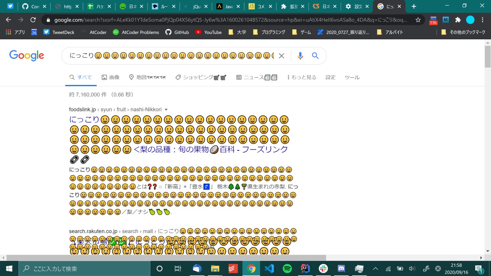
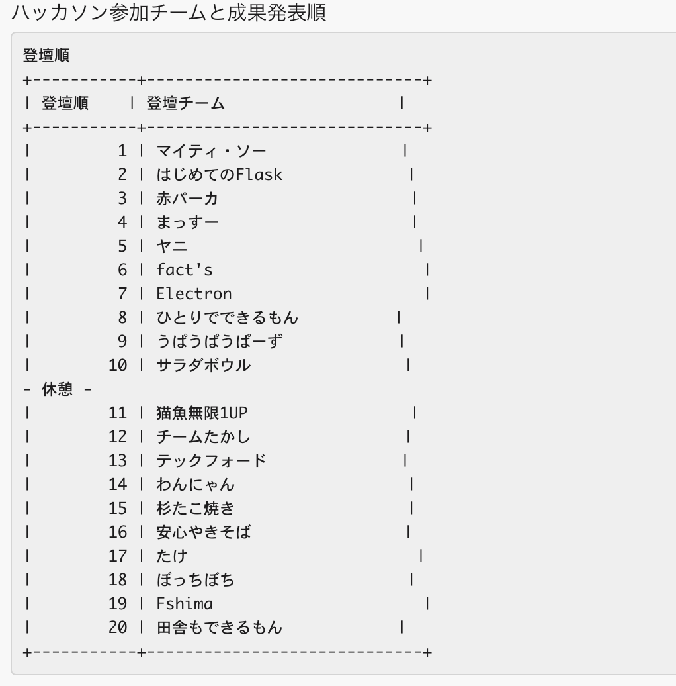
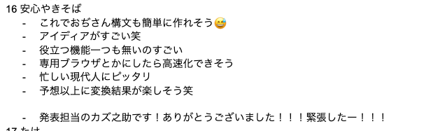

#### こんにちは！！！！！！！
こんにちは！！！！！！！！！！！！！！！！！！！！！！！！（クソでか挨拶）  
みんな大好き、幼女のカズ之助くんです。  
今回は、サポーターズとVOYAGEグループ主催のサマーハッカソンVol.2に参加したのでレポートですわよ！！！

#### サポーターズって？？？
就活生向けに就活支援を行っているサービスだよ！！  
もしこの記事を読んでいるみんなが就活生なら迷わず使ってみよう！！！  
でもね！就活生じゃなくても、参加できるイベント(技育祭や今回のハッカソンなど)もいっぱいあるので「いやいや自分は就活生じゃないので……」って人もとりあえず登録はしてみよう！！きっといいことがあるよ！(サポーターズの回し者じゃないです)

#### 今回何作ったの？
今回はChrome拡張機能を[ちよこちゃん](https://twitter.com/C_herec)と一緒に作りました！！！！！  
とりあえず登壇資料は[ここ](https://docs.google.com/presentation/d/1yfOMk3lGJ-1GZocnc_HPFeq3Psq0jcTTWf7G3H7uNPY/edit?usp=sharing)に置いておくのでまずはそっちを読んでみよう！！！  
読むのが面倒くさい兄貴/姉貴のために簡単に説明すると、**Chrome拡張機能**を作りました。  
どんな拡張機能かというと……
1. いくつかの文字を置き換えます
   - 例: `草`→`w`, `大草原`→`wwwwwwwwwww`, `研究室`→`🗡🌳🐮つ`
2. 形態素解析を用いて単語ごとに絵文字がヒットすれば追加します
   - 例: `日本`→`日本🎋🏯`, `プライバシー`→`プライバシー🔐`
3. ページのロードをめちゃくちゃ遅くします
   - ロード中にコーヒーを入れられるかもね！うれしいね。

#### 担当分け
##### カズ之助(Chrome拡張機能初挑戦)
- Twitter担当大臣
- ゆるふわ実装担当大臣
- 情報見つける担当大臣
- 高速化担当大臣
- <strong>幼女担当大臣(JSを書いたので)</strong>

##### ちよこ(Chrome拡張機能初挑戦)
- アイデア担当大臣
- JSON読み込み担当大臣
- 絵文字表示担当大臣
- ベンチマーク担当大臣

(スライドのちよこちゃんの部分にもしれっと「幼女担当大臣」って書いたら消されてしまった)

#### 使った技術
1. JavaScript
2. jQuery-3.5.1
3. [TinySegmenter](http://chasen.org/~taku/software/TinySegmenter/)(簡易形態素解析を行うライブラリ！ 日本語の文章を瞬時に単語ごとに分けてくれる！すごいね！！！)
4. [emoji-ja](https://github.com/yagays/emoji-ja)(この中の`keyword2emoji.json`を使ったよ！日本語のキーワードと絵文字の対応付けをしてくれるJSONファイルだよ！製作者のyagaysさんありがとう！！！)

#### タイムライン
##### 前日夜まで
チーム名を決めた！(チーム名: `安心やきそば`)
- ランダムワード生成機を回したら`焼きそば`と`安心`が出てきたので安直にくっつけてみました

##### 1日目
###### テーマ決め(開会式終了時〜12:30)
朝会終了後にDiscordの音声チャンネルに集合して作るものを決めたよ！  
そこでちよこちゃんが朝回に一緒に出席していた[草原大草原さん](https://twitter.com/k_y_kenzen)の名前を見て「これだ！」となったらしく、作るものが決まったよ！  
- なんか`草`を`w`に置き換えたら面白くね？ってなったっぽい！(実際にちょっと面白かった)
思いがけないところからアイデアをひろってくるちよこちゃんすごいわね

###### 試作機1号の作成(12:30〜12:50)
アイデアが決まったので、とりあえず作ってみることにしたよ！！  
`草`を`w`に置き換えるだけの簡単なお仕事だったのでインターネットの海からコードを見つけてそれを改変するだけで爆速で終わったよ！  
マジで開会式終了から1時間以内にとりあえず動くものができちゃったのでびっくりしちゃった  
- Chrome拡張機能ってこんなに簡単なんだな！って思ったわね

このまま開発を終わらせるのはめちゃくちゃつまらないので、また新しい要件を考えたよ！  
- 単語の後に絵文字がつくのはここで出た案

###### 1日目の残り(〜16:00の夕会まで)
ひたすら実装作業をしてたよ！  
なんか単語ごとに文章を区切ってくれる便利なライブラリ([TinySegmenter](http://chasen.org/~taku/software/TinySegmenter/))を見つけたよ！
- これ機能はめちゃめちゃシンプルだけど、その分めっちゃ手軽で簡単につかえていいね！！！

JavaScriptの変数に外部URLのJSONをパースしたものを読み込もうとしたけど思いの外手間取っちゃった！！  
- jQueryを使う方法とjQueryを使わない方法の2種類があったけど、どっちも直感的にjsonを連想配列に変換して、JSの配列に入れられなさそうで結構苦労した！
  - ちよこちゃんが実装してくれたよ！すごいね！ありがとう！

で、そんなこんなしていたら夕会の時間になっちゃった🌇

###### 夕会終了後…
夕会が終わって、どうせなら日付変わるまで作業しようと思ってDiscordに二人で籠もって作業していたら、思ったより進捗が生まれたよ！

  途中経過(<a href="https://twitter.com/C_herec/status/1306216338117935104/photo/1">ちよこニキのTwitterより</a>)

この画面を表示するのにめちゃくちゃ時間かかっちゃったよ！！！(ロード開始からだいたい1分くらい)  
この状態でYouTubeのトップ画面にアクセスしたら**約4分経っても何も表示されなかった**よ！！(重すぎ)  
で、いろいろ試行錯誤したら、絵文字の表示の処理(絵文字つきの単語と、絵文字をつけられる前の単語との置き換え処理)に問題があって、そのへんを修正したよ！  
とりあえずこれでめっちゃいっぱい絵文字が表示される問題は解決した……けど……  

流石に動作が重すぎるわね  

- 僕くん「1単語ごとにJSONファイル内を検索しているから遅くなっているのでは…？」  
- ↓  
- 僕くん「単語をいくつかスキップして、そのうえでキャッシュ空間を実装すればいいのでは？？？🤔」  

というわけで、
1. ひらがな1文字で構成された単語は処理をスキップすることにし、
2. 新規で検索した絵文字はキャッシュメモリの先頭に加える
3. キャッシュメモリから参照した絵文字もキャッシュメモリの先頭に持ってきて、それ以外のキャッシュメモリ内のデータを詰める(LRU処理をしてるよ！)

という処理を実装したよ！！

実装した結果は→**体感そんなに変わらんかったわw**
- →そもそも単語の量が膨大すぎてスキップする量を増やさないといけない…？？
- →ChromeのDeveloperToolのColsoleを見たら、どうやらjQueryでエラーが出てる…？？？(主にGoogleのページで発生する)
  - →Googleのページ以外ではそこそこ速い……ような気がする……そう思いたい……
- MITLicenseで公開しているのでJavaScriptつよっつよマンは気軽にプルリク送ってくれるとうれしいなぁ🥺🥺🥺🥺🥺🥺

まぁそんなこんなで2日目の深夜3時ちょい前くらいまで開発してました。あれ、カズ之助くん日付変わったら一旦やめるって言ってなかったっけ？

##### 2日目
###### 朝会(11:00から12:00)

目が覚めたら朝会終わってた

*な…、何を言っているのか わからねーと思うが、おれも何をされたのかわからなかった…* (寝坊した)  
みんなは、ハッカソン中でもちゃんと寝ようね！ｵﾁﾞｻﾝとのおやくそくだよ！

###### 日中(14:30位まで)
今日から大学も後期授業！  
本当は休む気満々だったけど僕の良心が*「どうしても行け」*というので、大学の後期日程ガイダンスに行っていました。

帰ってきたらコードフリーズ(これより先はコードいじっちゃだめだよ！っていう時間)まであと30分ないじゃん！！！やばばすぎんか！！！？？？？

###### コードフリーズまで(〜15:00)
とりあえず急いでプロダクトの名前を決めて`manifest.json`を書き換えて`master`にプッシュしてGitHub上で拡張機能を[リリース](https://github.com/kazuki19992/SummerHackathon2020/releases/tag/0.01)しました(コードフリーズ10秒前)  
流石にギリギリすぎる……

実質2日目なんてあってないようなものじゃん……(完全に深夜のせい)

###### 発表！！(16:00〜18:00くらいまで)
zoomに集まって発表したよ！！！

Slackに貼られた発表順 僕のチームは16番目でした

発表順は後半戦！みんなiOSアプリつくったり、機械学習で笑顔度を測定したり…… 面白いものばっかりだった！！！  
発表直前はすごく緊張したけど、発表終わった後にzoomのチャット欄とか、フィードバック用のGoogleDocsを見たら、めっちゃ盛り上がってて嬉しかった！！

弊チームのフィードバック

ここに書いてある***「役立つ機能一つも無いのすごい」***っての、最高の褒め言葉ですありがとうございます！！！！🙇‍♂️🙇‍♂️🙇‍♂️🙏😭😭😭😭😭  
[サポーターズの楓さん](https://twitter.com/kaepon1219)にも、zoomのチャット欄で、**「Googleで8秒はやばいw」**って書いてくれたり！

とっても楽しかった！！！またハッカソン参加したい！！！！！！

###### 懇親会！
めっちゃ酒飲んでた(大体1リットルくらいの酒を消費した気がする)  
とりあえず500mlのスーパードライは開始30分で全部消費しちゃいました。  
そこからずっとコークハイ飲みながら交流してました……！！

今回は3ターンともブレイクアウトルーム2にいて、そこに入ってくるいろいろな人と会話を楽しんでた！！  
みんな面白い人たちだったなぁ……！！！

#### 完走した感想ですが……
めっちゃ楽しかった！！！  
次回の開催まで全裸待機します!!!!!  

寂しがり屋のカズ之助くんは1人だったら参加していなかったです。そこで、ちよこくんに懇願して一緒にチーム組んで参加してもらいました！  
一緒に組んでくれてありがとう！！！サンキューちよこ、フォーエバー！！！！！

初ハッカソンですがマジで走っていて楽しかった！  
適宜Twitterで報告していたけど、反応もらったり、主催の[hironomiuさん](https://twitter.com/hironomiu)にも反応もらったりでうれしみだった！  
あと、みんなTwitterで適宜進捗を発表しようぜ！！！

また次回があったら参加したい！！！