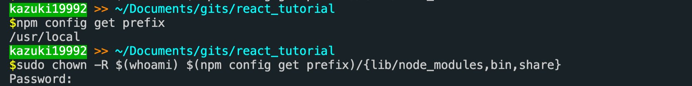

​
​
#### こんにちは！！！！！！！
こんにちは！！！！！！！！！！！！！！！！！！！！！！！！（クソでか挨拶）  
みんな大好き、幼女のカズ之助くんです。  
突然ですが……カズ之助くん、幼女なのでょゎょゎなんですよ。  
それで、ついさきほどなんですが、`webpack`を`npm`でグローバルインストールしようとしたらパーミッションエラーで入れられなくて泣いちゃったんですよね。  
幼女のカズ之助くんは怒られるのに慣れていません。あぁなんて可哀想……
​
#### ローカルインストールは？
ローカルインストールはできます。  
ただ、グローバルインストールができないので、`webpack`コマンドが使えないんですよねあぁ困った困った……
​
#### どんな感じになるかというと……
こんな感じになります

以下、文字起こし
```shell
$ npm install -g webpack webpack-cli
(省略)
gyp ERR! configure error
gyp ERR! stack Error: EACCES: permission denied, mkdir '/usr/local/lib/node_modules/webpack(省略)'
gyp ERR! System Darwin 19.6.0
gyp ERR! command "/usr/local/bin/node" "/usr/local/lib/node_modules/npm/node_modules/node-gyp/bin/node-gyp.js" "rebuild"
(省略)
```
なんか上の画像のように先頭に`sudo`つけても同じような感じでエラー出たのでちょっと悲しくなりました。  
(ほら、パーミッション関連だと`sudo`つければなんとかなっちゃうことが多いじゃないですか。大いなる力ですよ？)  
​
#### 解決方法
参考: [npmでpermission deniedになった時の対処法[mac] - qiita](https://qiita.com/okohs/items/ced3c3de30af1035242d)
​
やったことは、npmのディレクトリの所有者？を変更しました。  
1. npmのディレクトリのパスを確認して…
  ```shell
  $ npm config get prefix
  /usr/local
  ```
  <i class="fas fa-exclamation-triangle"></i>
  **あの、どうやらこれ出力が`/usr`ってなっていたら良くないようなので、その際は[これ](https://qiita.com/okohs/items/ced3c3de30af1035242d#%E5%AF%BE%E7%AD%962npm%E3%81%AE%E3%83%87%E3%83%95%E3%82%A9%E3%83%AB%E3%83%88%E3%83%87%E3%82%A3%E3%83%AC%E3%82%AF%E3%83%88%E3%83%AA%E3%82%92%E5%88%A5%E3%81%AE%E3%83%87%E3%82%A3%E3%83%AC%E3%82%AF%E3%83%88%E3%83%AA%E3%81%AB%E5%A4%89%E6%9B%B4%E3%81%99%E3%82%8B)を見てみよう！！**
2. npmディレクトリのオーナーを自分のアカウントに変更する
   ```shell
   $ sudo chown -R $(whoami) $(npm config get prefix)/{lib/node_modules,bin,share}
   ```
​

#### 動いた？
うごいた！！！！！！！！！！！！！！！！！

やったね！！！
