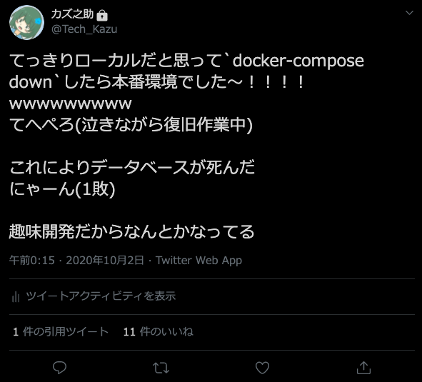

​
​
#### こんにちは……
こんにちは……（しょんぼり挨拶）  
やらかしました。カズ之助くんです。こんばんは。
​
#### したこと
私は**ローカル環境と本番環境を間違えて、今いる場所をローカル環境だと思い込み`docker-compose down`させてサービスを利用できなくしました**。  
そればかりではなく、**Dockerのコンテナ群は立ち上げるたびにIPアドレスが変わる**らしく、データベースへの接続に不具合が生じ、復旧までの15分ほど、サービスを利用不可能にしてしまいました……

マジで泣きそうになった

​
#### 原因
プロンプトが同じだから！！！！！！！  
これが一番大きいと思います……。パッと見でどの環境なのかわかるようにするべきです……。

Stdoの本番環境(ConoHa VPS)でのプロンプト

ローカル環境でのプロンプト

#### 復旧作業
mysqlにログインできなくなったので新しくユーザーを作成して権限を付与しました……
今までは **✝ r o o t ユ ー ザ ー ✝**を使っていたんですが(神なので)、流石に良くないので(しかも今回の件でルートユーザーでアクセスできなくなったので)、別にアカウントを作成してログインできるようにしました……

環境違いには気をつけよう！(ゆうさく注意喚起シリーズ)

​
#### 再発防止策
1. プロンプトの色をローカル環境と本番環境で違うものにします……
   1. 色が違えばパット見でわかりやすいもんね！
2. 指差し確認「ヨシ！」をします……ゼロ災でいこう！！(現場猫並感)
   1. 今回のは完全に現場猫案件なので……

みんなもこういう削除系や停止系のコマンドを入力する前に、いったん落ち着いて指差し確認をしよう！！！ヨシ！！！
