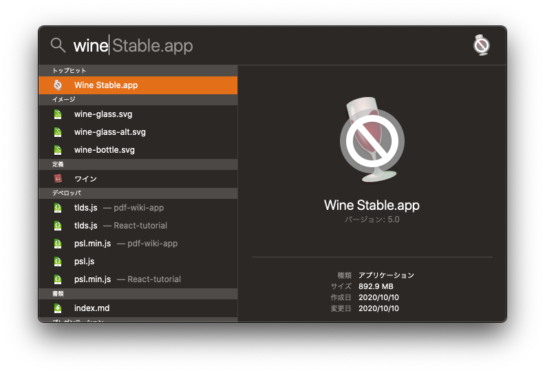
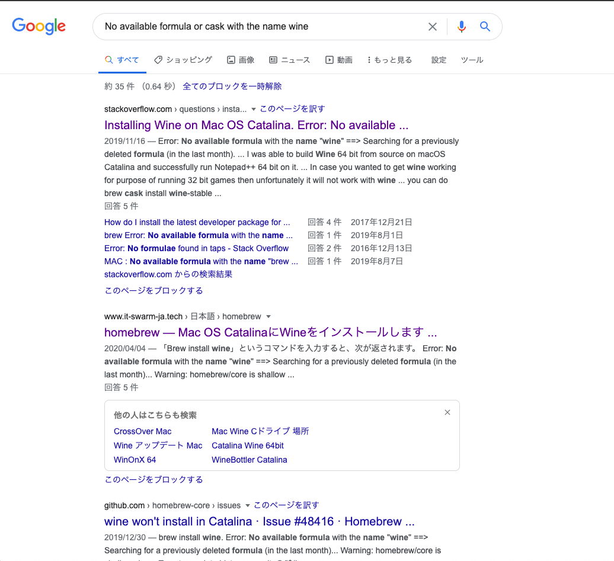
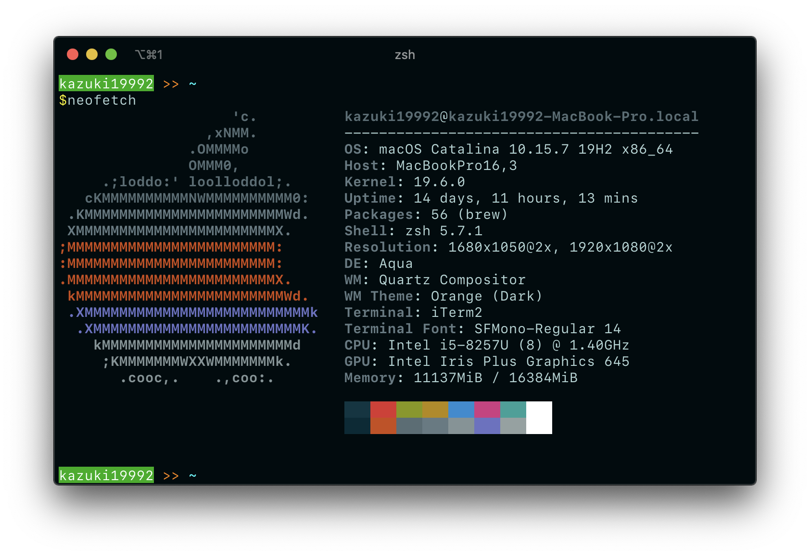

​
​
#### こんにちは！！
こんにちは！！（クソデカ挨拶）  
カズ之助くんです。こんばんは。
​
#### パッケージング！！
???「Electron製のデスクトップアプリケーションをWindows向けにパッケージング化しよう！**ただしmacOS上でな！！！！！**」

​
#### 調べてみた
どうやらmacOSでWindows向けにパッケージングするにはWineの導入が必要っぽい  
それで、色々調べてみると、wineを導入するには、Xなんちゃら(xquartz)の導入が必要っぽい……

面倒クセェな

#### Xなんちゃらの導入をしよう！！！
簡単です(簡単です)  
みんな大好き、ターミナルを開いて、以下のコマンドを入力してみよう
```shell
$ brew cask install xquartz
```

おなじみの🍺 のアイコンが出てきて`successfully installed!`って書いてあったら成功です！！おめでとう！！！！！！！！！
```shell
$ brew cask install xquartz
Updating Homebrew...
==> Tapping homebrew/cask
Cloning into '/usr/local/Homebrew/Library/Taps/homebrew/homebrew-cask'...
remote: Enumerating objects: 484398, done.
remote: Total 484398 (delta 0), reused 0 (delta 0), pack-reused 484398
Receiving objects: 100% (484398/484398), 221.67 MiB | 177.00 KiB/s, done.
Resolving deltas: 100% (343756/343756), done.
Tapped 1 command and 3677 casks (3,795 files, 237.4MB).
==> Downloading https://dl.bintray.com/xquartz/downloads/XQuartz-2.7.11.dmg
==> Downloading from https://d29vzk4ow07wi7.cloudfront.net/32e50e8f1e21542b84704
######################################################################## 100.0%
==> Verifying SHA-256 checksum for Cask 'xquartz'.
==> Installing Cask xquartz
==> Running installer for xquartz; your password may be necessary.
==> Package installers may write to any location; options such as --appdir are i
Password:
installer: Package name is XQuartz 2.7.11
installer: Installing at base path /
installer: The install was successful.
🍺  xquartz was successfully installed!
brew cask install xquartz  69.03s user 20.32s system 3% cpu 46:14.62 total
```

#### wineを入れよう！！！！
##### 公式インストーラー
公式の出しているインストーラー(安定版)から入れてみたよ！！

うーん……じゃ！！(知っておこう)

##### コマンド
ターミナルで続けてコマンドを入力しよう！！！
```shell
$ brew install wine
```

```shell
$ brew install wine
Updating Homebrew...
==> Auto-updated Homebrew!
Updated 2 taps (homebrew/core and homebrew/cask).
==> Updated Formulae
Updated 6 formulae.
==> Updated Casks
gisto                                    gobdokumente

Error: No available formula or cask with the name "wine".
==> Searching for a previously deleted formula (in the last month)...
Error: No previously deleted formula found.
==> Searching for similarly named formulae...
These similarly named formulae were found:
twine-pypi                 winetricks                 winexe
To install one of them, run (for example):
  brew install twine-pypi
==> Searching taps...
==> Searching taps on GitHub...
Error: No formulae found in taps.
brew install wine  5.73s user 3.43s system 10% cpu 1:23.82 total
```

ん？？？エラー出てない？？？？？？なんで？？？？？？？？？？？？？？？？？？  
話が違うよ！！！！！！！！！！！！！！！！！！！！！！！！！！！！！！！！！

エラー文中のコマンド`brew install twine-pypi`を試してみる
```shell
$ brew install twine-pypi
```
```shell
$brew install twine-pypi
Updating Homebrew...
==> Downloading https://homebrew.bintray.com/bottles/python%403.9-3.9.0.catalina
==> Downloading from https://d29vzk4ow07wi7.cloudfront.net/d53f6e27e9488d57e6fa7
######################################################################## 100.0%
==> Downloading https://homebrew.bintray.com/bottles/twine-pypi-3.2.0_1.catalina
==> Downloading from https://d29vzk4ow07wi7.cloudfront.net/d94f3f8df7fda5c17f09d
######################################################################## 100.0%
==> Installing dependencies for twine-pypi: python@3.9
==> Installing twine-pypi dependency: python@3.9
==> Pouring python@3.9-3.9.0.catalina.bottle.tar.gz
==> /usr/local/Cellar/python@3.9/3.9.0/bin/python3 -s setup.py --no-user-cfg ins
==> /usr/local/Cellar/python@3.9/3.9.0/bin/python3 -s setup.py --no-user-cfg ins
==> /usr/local/Cellar/python@3.9/3.9.0/bin/python3 -s setup.py --no-user-cfg ins
==> Caveats
Python has been installed as
  /usr/local/bin/python3

Unversioned symlinks `python`, `python-config`, `pip` etc. pointing to
`python3`, `python3-config`, `pip3` etc., respectively, have been installed into
  /usr/local/opt/python@3.9/libexec/bin

You can install Python packages with
  pip3 install <package>
They will install into the site-package directory
  /usr/local/lib/python3.9/site-packages

See: https://docs.brew.sh/Homebrew-and-Python

python@3.9 is keg-only, which means it was not symlinked into /usr/local,
because this is an alternate version of another formula.

If you need to have python@3.9 first in your PATH run:
  echo 'export PATH="/usr/local/opt/python@3.9/bin:$PATH"' >> ~/.zshrc

For compilers to find python@3.9 you may need to set:
  export LDFLAGS="-L/usr/local/opt/python@3.9/lib"

For pkg-config to find python@3.9 you may need to set:
  export PKG_CONFIG_PATH="/usr/local/opt/python@3.9/lib/pkgconfig"

==> Summary
🍺  /usr/local/Cellar/python@3.9/3.9.0: 4,459 files, 72.3MB
==> Installing twine-pypi
==> Pouring twine-pypi-3.2.0_1.catalina.bottle.tar.gz
🍺  /usr/local/Cellar/twine-pypi/3.2.0_1: 1,481 files, 15.3MB
==> Caveats
==> python@3.9
Python has been installed as
  /usr/local/bin/python3

Unversioned symlinks `python`, `python-config`, `pip` etc. pointing to
`python3`, `python3-config`, `pip3` etc., respectively, have been installed into
  /usr/local/opt/python@3.9/libexec/bin

You can install Python packages with
  pip3 install <package>
They will install into the site-package directory
  /usr/local/lib/python3.9/site-packages

See: https://docs.brew.sh/Homebrew-and-Python

python@3.9 is keg-only, which means it was not symlinked into /usr/local,
because this is an alternate version of another formula.

If you need to have python@3.9 first in your PATH run:
  echo 'export PATH="/usr/local/opt/python@3.9/bin:$PATH"' >> ~/.zshrc

For compilers to find python@3.9 you may need to set:
  export LDFLAGS="-L/usr/local/opt/python@3.9/lib"

For pkg-config to find python@3.9 you may need to set:
  export PKG_CONFIG_PATH="/usr/local/opt/python@3.9/lib/pkgconfig"

brew install twine-pypi  9.16s user 9.26s system 32% cpu 55.897 total
```
これで……入ったのか？？？
```shell
$ which wine
wine not found
```
うーん……なーんか入ってなさげ……

もう一回`brew install wine`をしてみる……
```shell
$ brew install wine
Updating Homebrew...
Error: No available formula or cask with the name "wine".
==> Searching for a previously deleted formula (in the last month)...
Error: No previously deleted formula found.
==> Searching for similarly named formulae...
These similarly named formulae were found:
twine-pypi ✔               winetricks                 winexe
To install one of them, run (for example):
  brew install twine-pypi ✔
==> Searching taps...
==> Searching taps on GitHub...
Error: No formulae found in taps.
brew install wine  3.27s user 1.34s system 57% cpu 7.938 total
```
`wine-pypi`に✔がついてる！！他の2つにもやればいいのかな…？

###### winetricks
```shell
$ brew install winetricks
Updating Homebrew...
==> Downloading https://homebrew.bintray.com/bottles/cabextract-1.9.1.catalina.b
######################################################################## 100.0%
==> Downloading https://homebrew.bintray.com/bottles/p7zip-16.02_2.catalina.bott
==> Downloading from https://d29vzk4ow07wi7.cloudfront.net/b9f5fb1321ce5738d0129
######################################################################## 100.0%
==> Downloading https://homebrew.bintray.com/bottles/unrar-5.9.4.catalina.bottle
==> Downloading from https://d29vzk4ow07wi7.cloudfront.net/90e0f209046471dda292a
######################################################################## 100.0%
==> Downloading https://github.com/Winetricks/winetricks/archive/20200412.tar.gz
==> Downloading from https://codeload.github.com/Winetricks/winetricks/tar.gz/20
                  -=O=-    #     #     #      #
==> Installing dependencies for winetricks: cabextract, p7zip and unrar
==> Installing winetricks dependency: cabextract
==> Pouring cabextract-1.9.1.catalina.bottle.tar.gz
🍺  /usr/local/Cellar/cabextract/1.9.1: 10 files, 146.5KB
==> Installing winetricks dependency: p7zip
==> Pouring p7zip-16.02_2.catalina.bottle.tar.gz
🍺  /usr/local/Cellar/p7zip/16.02_2: 103 files, 4.5MB
==> Installing winetricks dependency: unrar
==> Pouring unrar-5.9.4.catalina.bottle.tar.gz
🍺  /usr/local/Cellar/unrar/5.9.4: 6 files, 503.5KB
==> Installing winetricks
🍺  /usr/local/Cellar/winetricks/20200412: 6 files, 865.0KB, built in 3 seconds
brew install winetricks  9.56s user 4.89s system 17% cpu 1:24.05 total
```
###### winexe
```shell
$ brew install winexe
Updating Homebrew...
==> Downloading https://homebrew.bintray.com/bottles/winexe-1.00.catalina.bottle
==> Downloading from https://d29vzk4ow07wi7.cloudfront.net/4706b05f203ecaf3a56fc
######################################################################## 100.0%
==> Pouring winexe-1.00.catalina.bottle.tar.gz
🍺  /usr/local/Cellar/winexe/1.00: 41 files, 5.6MB
brew install winexe  2.92s user 1.81s system 34% cpu 13.806 total
```

再挑戦してみたものの……
```shell
$ brew install wine
Updating Homebrew...
Error: No available formula or cask with the name "wine".
==> Searching for a previously deleted formula (in the last month)...
Error: No previously deleted formula found.
==> Searching for similarly named formulae...
These similarly named formulae were found:
twine-pypi ✔               winetricks ✔               winexe ✔
To install one of them, run (for example):
  brew install twine-pypi ✔
==> Searching taps...
==> Searching taps on GitHub...
Error: No formulae found in taps.
brew install wine  2.99s user 1.19s system 39% cpu 10.584 total
```
最初のエラー文を見てみると`Error: No available formula or cask with the name "wine".`と書いてある……
これでまんま検索してみると……

Catalina特有のエラー…？？？

ちなみに僕のOSもCatalinaです

Catalinaに対応してないのかな……？？？

インストールできたら追記するのです……